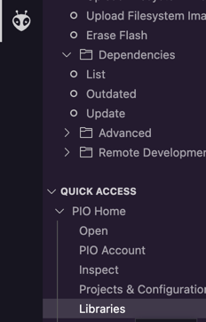

# TFT Screen
## Deps

Go to platform.io tab and choose libraries



### Install the library `TFT_eSPI`

Next you will be doing some configuring to use the right drivers for the screen. 

Go to, in your project, `.pio/libdeps/[your board]/TFT_eSPI/User_Setup.h`

1. Uncomment the line `#define ST7735_DRIVER` so that driver is used. Comment out the already defined driver.
2. Uncomment lines 207-211 so that it looks like this:
 ```#define TFT_MOSI 23
#define TFT_SCLK 18
#define TFT_CS   15  // Chip select control pin
#define TFT_DC    2  // Data Command control pin
#define TFT_RST   4  // Reset pin (could connect to RST pin)
```
This is your pin configuration whilst also 

VCC => 5v

GND => GND 

SDA => 23

LEDA => 3v3

3. IF you see that red and blue colors are reversed on your screen, you can uncomment line 76 `#define TFT_RGB_ORDER TFT_RGB`
4. All set!

## Testing 

```cpp
#include <TFT_eSPI.h> // Graphics and font library for ST7735 driver chip
#include <SPI.h>
#include "graphics.h"

TFT_eSPI tft = TFT_eSPI();  // Invoke library, pins defined in User_Setup.h

void setup () {
   printSomeFunStuff(tft);
}
```

Create a file `graphics.h` (the one we import above) and declare a function named `printSomeFunStuff`

```cpp
void printSomeFunStuff(TFT_eSPI) {
  tft.fillScreen(TFT_BLUE);
  tft.setCursor(0, 0, 2);
  tft.setTextColor(TFT_RED,TFT_BLACK);    tft.setTextFont(2);
  tft.println("IoT Knowabunga 2023");

  // Set the font colour to be green with black background, set to font 2
  tft.setTextColor(TFT_GREEN,TFT_BLACK);
  tft.setTextFont(2);
  tft.println("Schedule:");
  tft.setTextFont(1);
  tft.println("09:00 - Introduction");
  tft.println("12:00 - Lunch");
  tft.println("13:00 - TTV hackathon");
  tft.println("17:00 - Dinner and AW");
 }
```

### Extras

Try displaying some images or animations. 
Look in `.pio/libdeps/[your board]/TFT_eSPI/examples`

A useful tool for converting images to bitmaps: https://javl.github.io/image2cpp/

